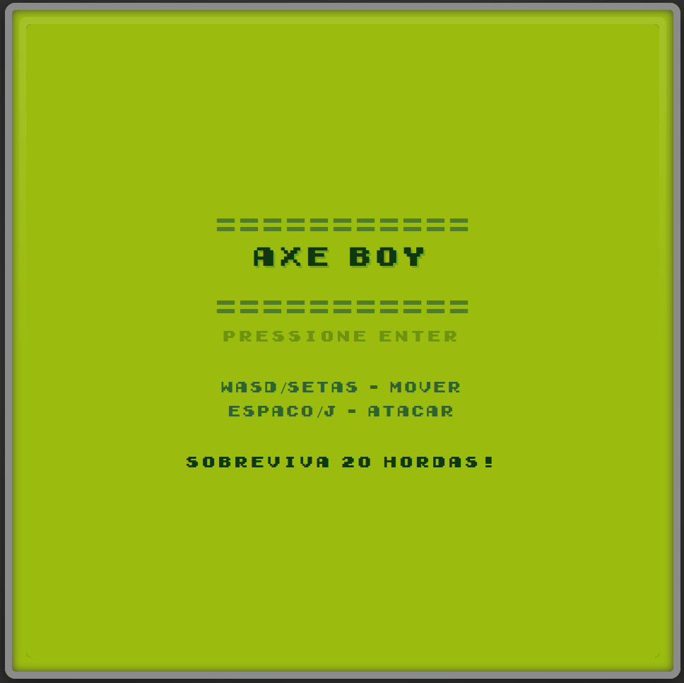
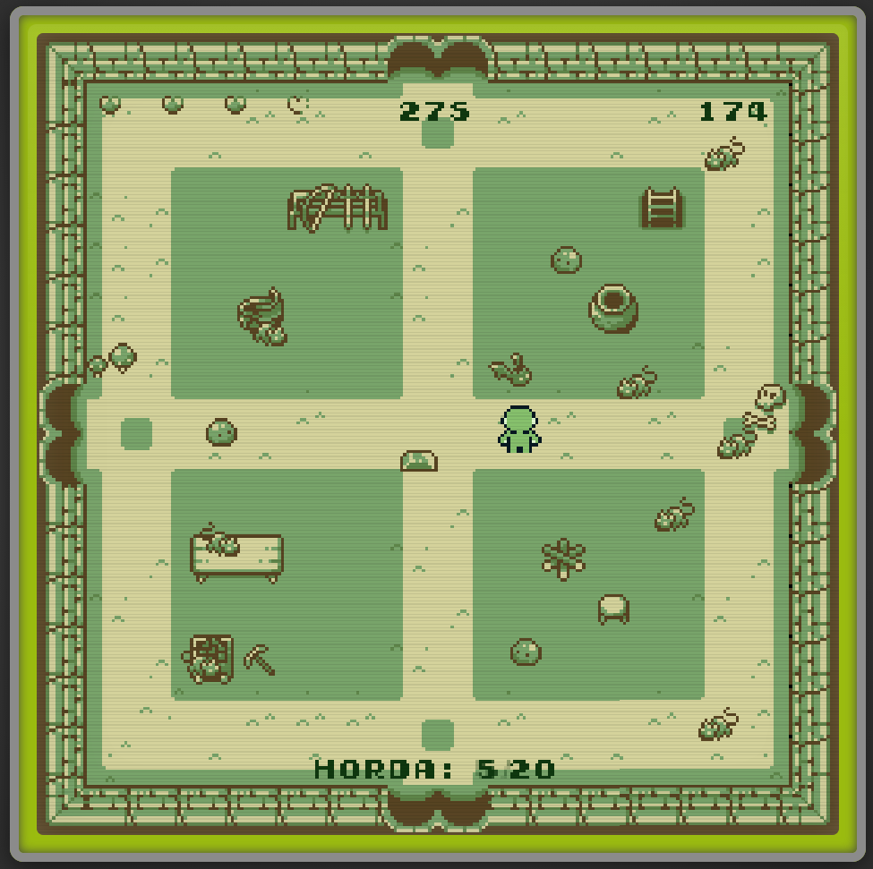

# AXE BOY

## Descrição

**AXE BOY** é um jogo de ação e sobrevivência em estilo retro Game Boy, onde você controla um garoto armado com um machado mágico que retorna após ser lançado. Enfrente hordas crescentes de inimigos (ratos, slimes e morcegos) em uma batalha pela sobrevivência!

**Objetivo:** Sobreviva a 20 hordas de inimigos cada vez mais difíceis e alcance a vitória!

## Desenvolvedores

- **Bruno Cesar Jesus de Almeida**
- **Jean de Souza Morais**
- **João Victor de Lima Pereira**

## Ferramenta Utilizada

- **MelonJS v17.4.0** - Engine JavaScript para desenvolvimento de jogos 2D
- **HTML5/CSS3/JavaScript** - Interface e overlays do jogo

## Como Jogar

### Controles:

- **WASD** ou **Setas** - Movimentação em 8 direções
- **Espaço** ou **J** - Atacar com machado
- **ENTER** - Iniciar jogo no menu
- **F5** - Reiniciar após Game Over ou Vitória

### Mecânicas:

- Derrote inimigos para ganhar pontos:
  - Rato: 3 pontos
  - Slime: 5 pontos
  - Morcego: 10 pontos
- Colete corações para recuperar vida (máximo 4)
- Colete moedas de ouro para ganhar pontos extras (+10)
- Sobreviva a 20 hordas progressivamente mais difíceis

## Instruções de Instalação e Execução

### Requisitos:

- Python 3.x instalado no sistema
- Navegador web moderno (Chrome, Firefox, Edge, etc.)

### Passos:

1. **Clone ou baixe o repositório**

   ```bash
   git clone https://github.com/BrunoJesus6/game_axe_boy.git
   ```

2. **Inicie um servidor HTTP local**

   ```bash
   python -m http.server
   ```

3. **Acesse no navegador**
   - Abra seu navegador e acesse: `http://localhost:8000`

## Capturas de Tela

### Menu Principal



### Gameplay e Sistema de Hordas



## Assets e Créditos

### Arte e Gráficos:

- **Personagem em 8 direções (Game Boy)** – [GibbonGL](https://gibbongl.itch.io/8-directional-gameboy-character-template)
- **Elementos gráficos do mapa** – [Toadzill Art](https://toadzillart.itch.io/)
- **Inimigos (rato, morcego e slime)** – [Toadzill Art](https://toadzillart.itch.io/)
- **Font GameBoy** – [Jimmy Campbell](https://www.dafont.com/early-gameboy.font)

### Áudio:

- **Música de Background** – [bobbeats](https://pixabay.com/sound-effects/8-bit-loop-music-290770)
- **Efeitos Sonoros** – [Drinken5482](https://pixabay.com/sound-effects/retro-hurt-2-236675), [Audley Fergine](https://pixabay.com/sound-effects/classic-8-bit-swoosh-sfx-342597), [Data_pion](https://pixabay.com/sound-effects/sfx10-impact-324522), [freesound_community](https://pixabay.com/sound-effects/hurt-c-08-102842)
- **Música de Game Over** – [Make More Sound](https://pixabay.com/sound-effects/8-bit-video-game-lose-sound-version-1-145828)
- **Música de Vitória** – [Lesiakower](https://pixabay.com/sound-effects/level-up-enhancement-8-bit-retro-sound-effect-153002)

## Estrutura do Projeto

```
game/
├── index.html              # Arquivo principal
├── src/
│   ├── assets/
│   │   ├── audio/         # Músicas e efeitos sonoros
│   │   ├── fnt/           # Fontes
│   │   ├── img/           # Sprites e imagens
│   │   ├── mapJson/       # Mapa do jogo (Tiled)
│   │   └── style/         # Estilos CSS
│   ├── js/
│   │   ├── enemy/         # Classes dos inimigos
│   │   ├── player/        # Classe do jogador
│   │   ├── systems/       # Sistemas (hordas, drops, morte)
│   │   ├── ui/            # Interface (HUD, overlays, menu)
│   │   ├── weapons/       # Arma (machado)
│   │   ├── game.js        # Inicialização do jogo
│   │   └── play.js        # Tela de gameplay
│   └── lib/
│       └── melonjs.module.js  # Engine do jogo
└── README.md
```

## Características Técnicas

- **Resolução:** 256x256 pixels (escala 2.8x)
- **Estilo visual:** Game Boy LCD com efeito de scanlines
- **Sistema de colisão:** Baseado em física 2D do MelonJS
- **Sistema de pontuação:** Progressivo com drops aleatórios
- **Sistema de hordas:** 20 níveis com dificuldade crescente
- **Audio:** Música de fundo + efeitos sonoros 8-bit

## Problemas Conhecidos

- Nenhum bug crítico identificado
- Jogo testado e estável

## Licença

Este projeto foi desenvolvido para fins educacionais como parte do curso de Desenvolvimento de Jogos.

---

**Desenvolvido com ❤️ usando MelonJS**
